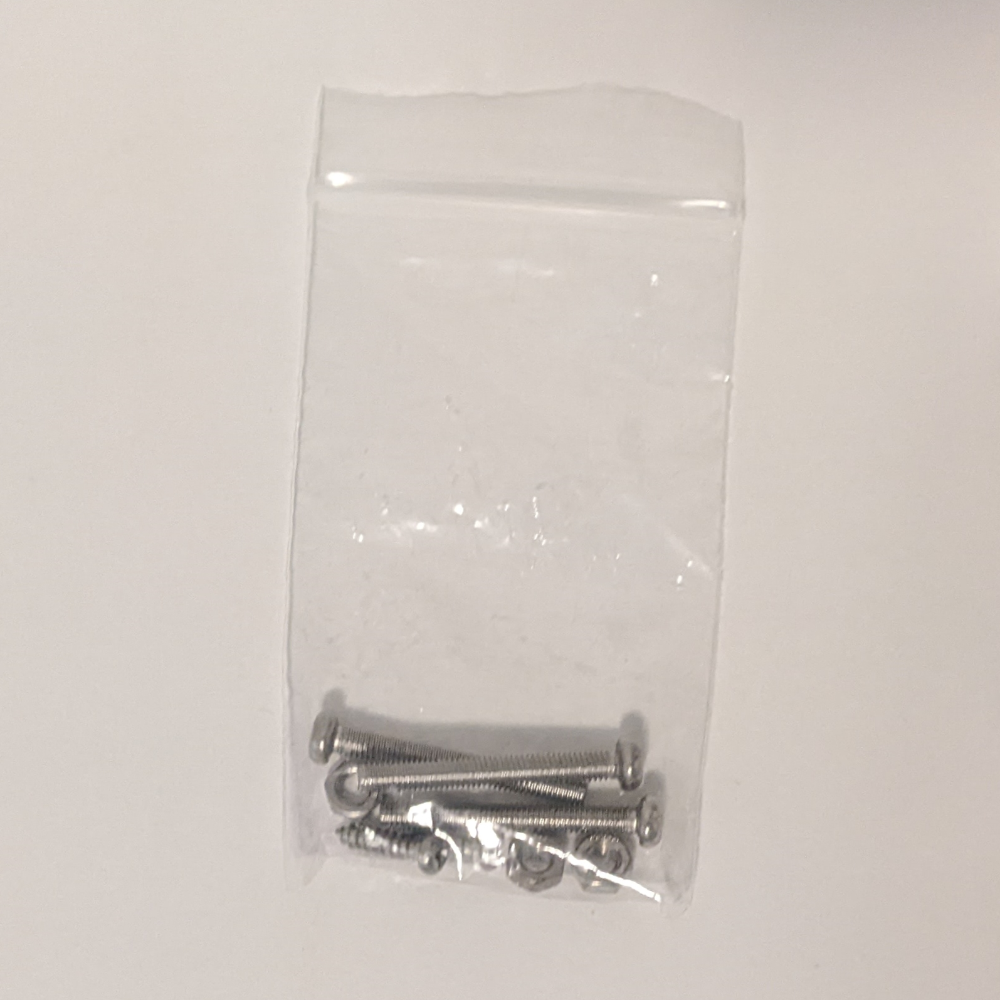
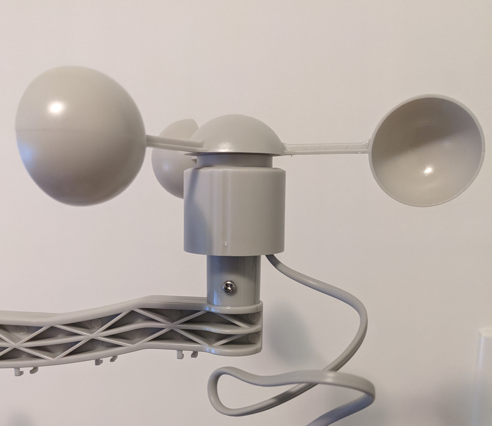
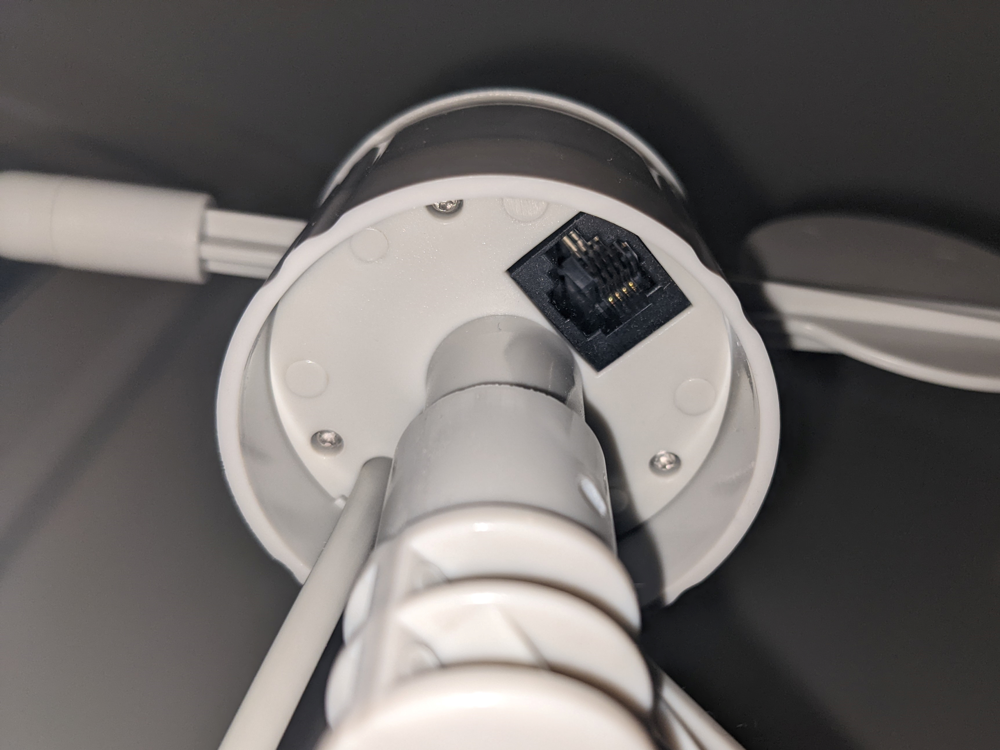
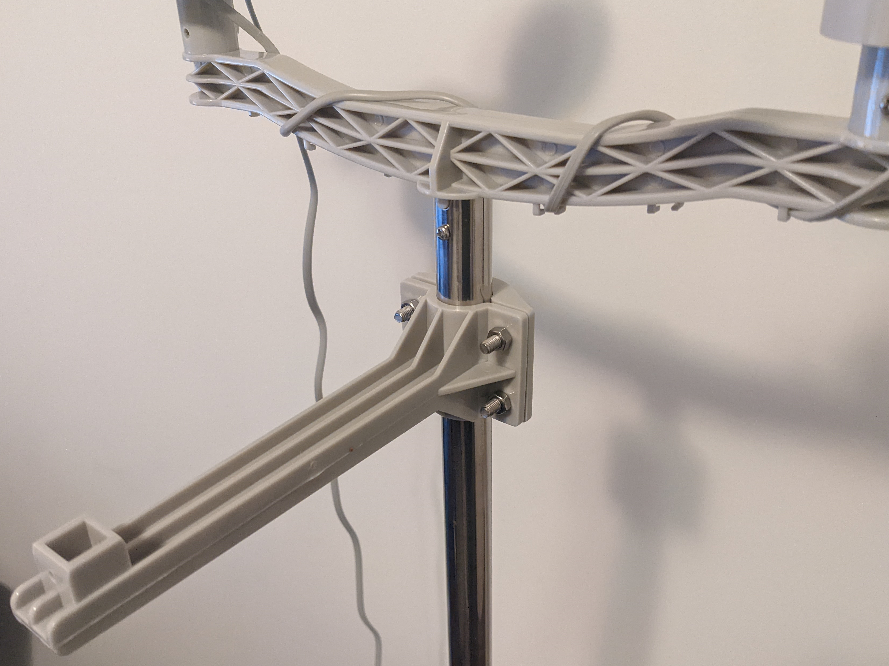
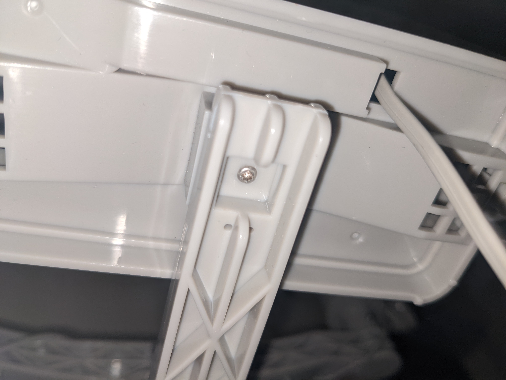
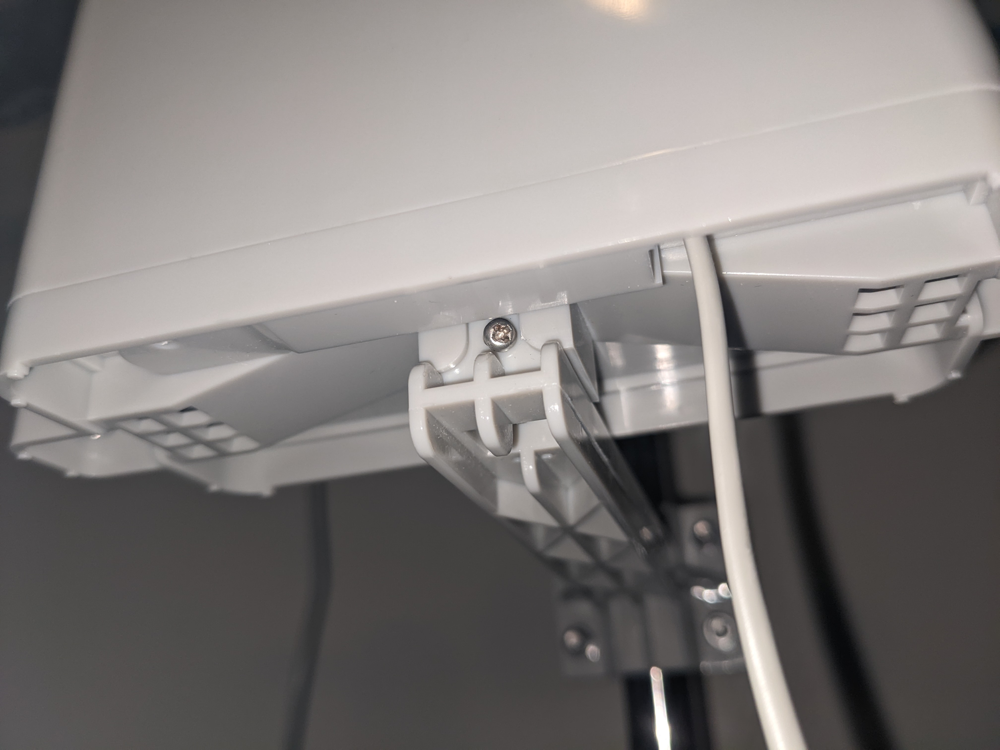

# Weather Sensors Assembly
 
To assemble the Clima.Pro kit, you'll need this little bag with three long screws and bolts, along with 2 small short screws.

## Clima.Pro structure

Start connecting both steel tubes like so:

In one of the ends of the tubes it has a gap at the lip with a small hole below it. Place the sensor support structure here and secure it with one of the long screws and a bolt:

Grab the anemometer sensor and place it on one of the ends of the support piece. It can connect in three positions, the right position should align a hole of the sensor and the support piece so you can insert one of the long screws so you can secure it with a bolt.

Now take the Wind Vane sensor and place it on the other end of the support structure and secure it with the third and last long screw and bolt.

If you look under the Wind Vane, you'll see theres a black port. Take the cable of the Anemometer, loop it around the support piece as it goes to the Wind Vane and connect it to that port.

Your kit should be looking like this:

Now lets install the Rain meter sensor. Grab the rain meter support piece and secure it on the tube about an inch below top of the tube, perpendicular to the anemometer/wind vane support piece.

Take the Rain Meter and put it on the end of the support piece. Right underneath you can grab the smallest screw to secure it with the base. 

If you'd look the rain meter on its side, you'll see another small hole where you would use the last small screw to further secure the sensor in place.

