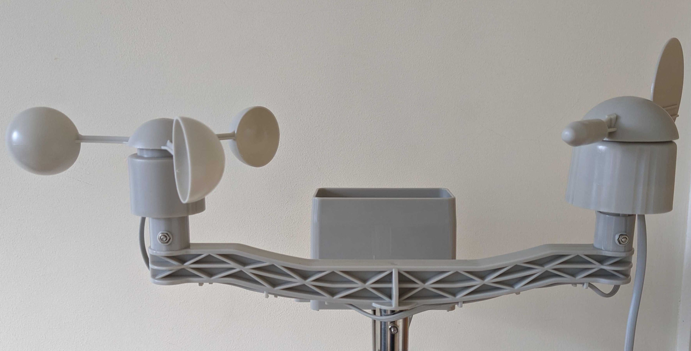

# Weather Sensors Assembly

To assemble the whole Clima kit with all it's sensors, you'll need the set of 3 long screws with it's bolts, and 2 smaller screws. They should be in a little zip lock bag like this:

## Assembling

Start by connecting the two steel tubes together like so:

Next, one of the tube ends has a small rounded gap and a hole right below it. In that end, place the sensor support for the wind vane and anemometer. Use one of the long screws and bolts to fix the support to the tube.

On the right end of the support piece you can put the anemometer. It has three possible positions to connect it to the base, keep rotating it until you see the the hole to insert another long screw and bolt to secure it to the support.

On the left side of the support you can place the wind vane. Like we did with the Anemometer, make sure to position it correctly to use the third and final screw and bolt to secure the sensor to the support.

Under the wind vane you can see a small connection port. Take the short cable of the anemometer and loop it around the support piece as we make our way to the wind vane and connect the end to the port underneath.

At this point, you should have something like this:

About an inch lower of the tube end where the suport piece is, grab the rain meter support piece and secure it on the tube, making sure its perpendicular to the other two sensors.

Take the rain meter and place it on the support piece and secure it with the last two small screws: one goes in the bottom and the other on one of the sides: 

About one inch above where the steel tubes connect, mount the Clima Meadow module on the tube.

Now you can connect the rain meter sensor in the middle port and the wind sensor on the other connector available. The round port is used for the solar panel. 

Additionally, you can tidy the cable of the wind sensors by looping it around its support piece and/or tubes, making your way to the Meadow module.

You can do the same with the rain meter sensor's cable, looping it around its support piece, making your way to the Meadow enclosure.

## [Next - Enclosure Assembly](../Enclosure_Assembly/readme.md)
