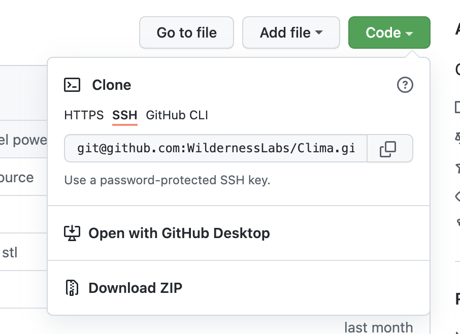

## Clima.Pro Application Deployment

### Step 1. - Prepare Dev Environment

 * **Download and install [Visual Studio](https://visualstudio.microsoft.com/)** - For either Windows or macOS. Community edition will work fine.

 * **Follow the [Meadow.OS Deployment Guide](http://developer.wildernesslabs.co/Meadow/Getting_Started/Deploying_Meadow/)**
   * Install Meadow.CLI
   * Download the latest Meadow.OS and flash it to the Meadow board.

 * **Follow the [`Hello, Meadow` Guide](http://developer.wildernesslabs.co/Meadow/Getting_Started/Hello_World/)**
   * Install the Meadow Visual Studio Extension(s).
   * Create and deploy the Meadow template application to ensure everthing is setup correctly.

### Step 2. - Deploy the Clima App

 * **Clone the Clima Repo** - Click the `Code` button above to clone this this repo locally:
   
 * **Open the Clima VS Solution** - Navigate to the `source` folder and open the `Clima.sln` file in Visual Studio, or the `source` folder in VS Code.
 * **Add your OpenWeather API Key** - To the application config [or whatever: **JORGE TO UPDATE**]
 * **Add WiFi Credentials** - Edit the `Wifi.cs` [or whtaever **JORGE**] file to have the correct credentials for the WiFi your Clima will connect to.
 * **Deploy the Clima.Pro.Meadow App** - [JORGE: is that the name of it?]
