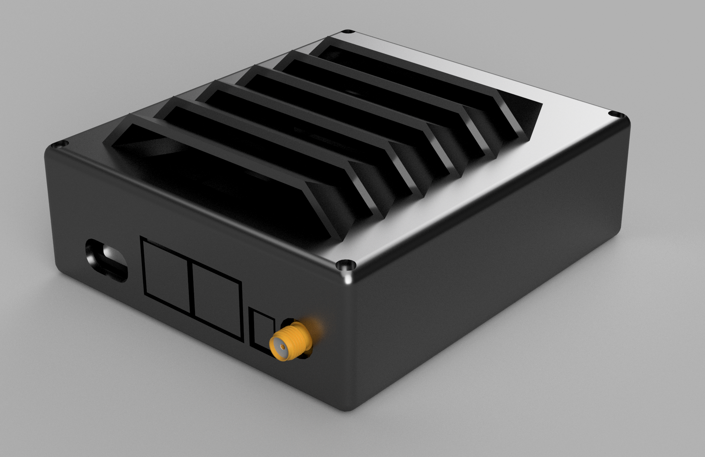

# Industrial Design

Clima.Pro uses a 3D-Printable enclosure that holds the Meadow board and the custom Clima PCB. 

The enclosure was designed used AutoDesk Fusion 360, and if you want to customize it, you can find the design source in the source folders:
 * [V1](v1/Enclosure/Source)
 * [v3](v3/Enclosure/Source)

The STL files can be found in the `STLs_for_Printing` folder
 * [V1](v1/Enclosure/STLs_for_Printing)
 * [V3](v3/Enclosure/STLs_for_Printing)