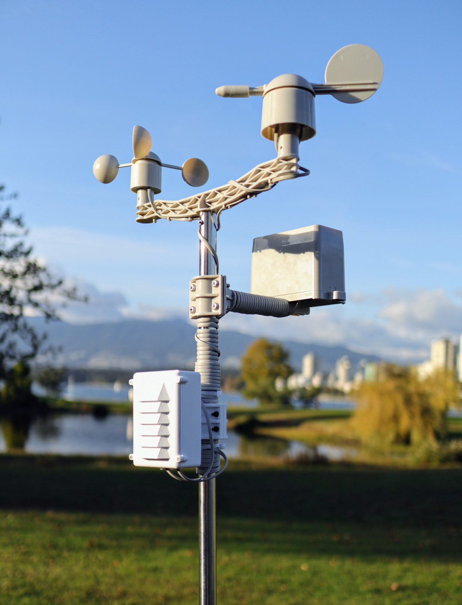
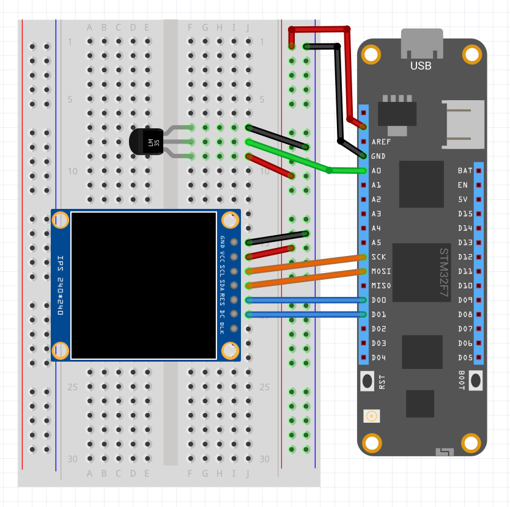

# Clima

A simple, Meadow-powered climate station. Includes basic versions that you can build with a [Hack Kit](https://store.wildernesslabs.co/collections/frontpage/products/meadow-f7-micro-development-board-w-hack-kit-pro) and a [Pro version](https://store.wildernesslabs.co/collections/frontpage/products/clima-weather-station-kit) with a complete climate station.




Also includes an ASP.NET Core Web API application to test against.

## Meadow Clima Circuit

With an LM35 Analog Temperature sensor, and a TFT SPI ST7789 display (both included in the Hack Kit), wire your board like the following Fritzing Diagram:



## Projects

* **WildernessLabs.Clima.Contracts** - Shared project with the data models that are shared amongs the various projects.
* **WildernessLabs.Clima.Meadow.Pro** - A client Meadow application to use with the Clima Pro climate station hardware.
* **WildernessLabs.Clima.Meadow.HackKit** 
built with the components in the Hack Kit.
* **WildernessLabs.Clima.Server.Mini.Tests** - A console application used to test the Mini server.
* **WildernessLabs.Clima.Server.Mini** - A very basic local test Web API server written in ASP.NET Core.


## Server Web API

The mini Clima server stores `ClimateReading` objects in memory will populate itself with a sample reading on start so there is always some dummy data in there.

### Getting a List of Climate Readings

**Get** - http://localhost:[port]/ClimateData

### Posting a new Reading

**Post** - http://localhost:[port]/ClimateData

Sample body payload:

```json
{
    "timeOfReading": "2020-09-23T17:43:00-07:00",
    "tempC": 23,
    "barometricPressureMillibarHg": 250,
    "relativeHumdity": 0.7
}
```
