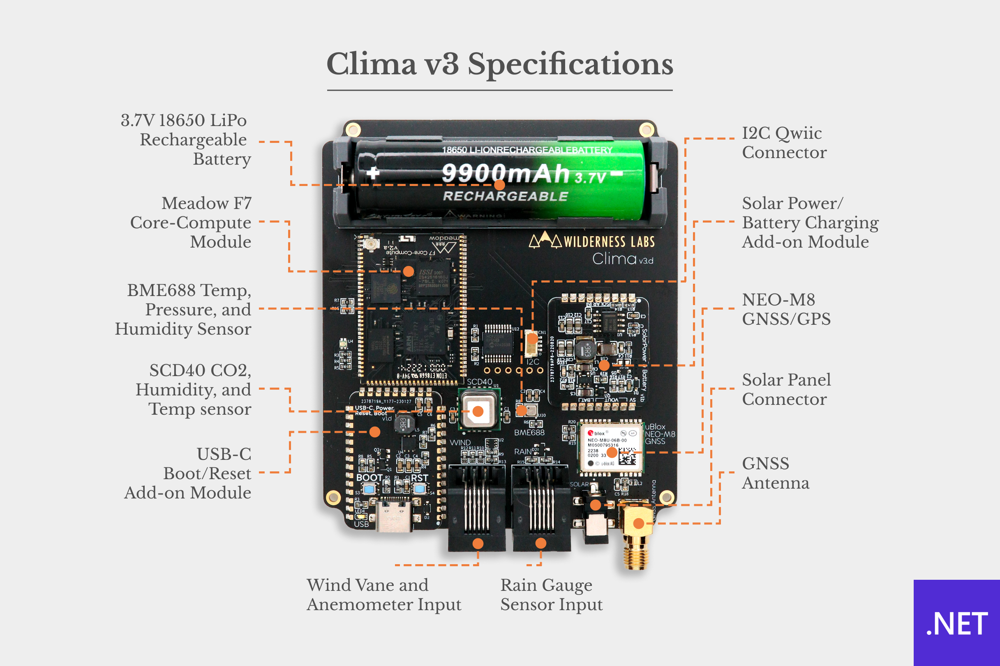

Clima is a solar-powered, custom embedded-IoT solution that tracks climate from a suite of sensors, saves data locally for access via Bluetooth, uses a RESTful Web API, and synchronizes data to the cloud.

## Contents
* [Clima Versions](#clima-versions)
* [Assembly Instructions](#assembly-instructions)
* [Getting Started](#getting-started)
* [Hardware Specifications](#hardware-specifications)
* [Mobile Companion App](#mobile-companion-app)
* [Get an API Key for OpenWeather](#get-an-api-key-for-openweather)
* [Clima.HackKit](#climahackkit)
* [Support](#support)

## Clima Versions

We offer clima in two options, a full dedicated kit that it's fully solar powered build and ideal to measure weather outdoors, or a much simplified version that you can build with our Hack Kits.

Both versions are 100% open source, including all of the enclosure design files, and PCB design of the pro version.

<table width="100%">
    <tr>
        <td width="50%">
            <strong><a href="https://store.wildernesslabs.co/collections/frontpage/products/clima-weather-station-kit">Clima.Pro Version</a></strong>
        </td>
        <td width="50%">
            <strong><a href="https://store.wildernesslabs.co/collections/frontpage/products/meadow-f7-micro-development-board-w-hack-kit-pro">Clima.HackKit Version</a></strong></td>
    </tr>
    <tr>
        <td>
            
        </td>
        <td>
             
        </td>
    </tr>
    <tr>
        <td>
            With this kit, it includes the complete package of sensors, PCB enclosure and mount to place this outdoors. You'll be able to measure wind speed/direction, rain volume, atmospheric conditions like temperature, pressure, humidity, CO2 levels and GPS Coordinates.
        </td>
        <td> 
            With the Hack Kit, you can build this project to measure indoor room temperature with an analog temperature sensor, use a 240x240 TFT Spi display and three push buttons to build a simple UI using MicroGraphics to do things like change temperature units, and more.
        </td>
    </tr>
</table>

## Assembly Instructions

A complete kit of Clima.Pro can be found on the [Wilderness Labs Store](https://store.wildernesslabs.co/collections/frontpage/products/clima-weather-station-kit) and the Instructions for assembly can be found [here](/Docs/Clima.Pro/Assembly_Instructions/readme.md).

The store version is 100% kit complete, including the option to upgrade the PCB, Enclosure and Battery only, if you include a previous version of the kit.

You can also source all of the components yourself. For a list of components see the [Clima Pro Bill of Material (BoM)](/Docs/Clima.Pro/Bill_of_Materials.md)

## Getting Started

To simplify the way to use this Meadow-powered reference IoT product, we've created a NuGet package that instantiates and encapsulates the onboard hardware into a `Clima` class.

1. Add the ProjectLab Nuget package your project: 
    - `dotnet add package Meadow.Clima`, or
    - [Meadow.Clima Nuget Package](https://www.nuget.org/packages/Meadow.Clima/)

2. Instantiate the `IClimaHardware` object:  
```csharp
public class MeadowApp : App<F7CoreComputeV2>
{
    IClimaHardware clima;

    public override Task Initialize()
    {
        clima = Clima.Create();
        ...
```

3. To Access the `Clima` onboard peripherals (AtmosphericSensor, for example):
```csharp
    if (clima.AtmosphericSensor is { } bme688)
    {
        bme688.Updated += Bme688Updated;
        bme688.StartUpdating();
    }
```

4. Like on step 3, you can also access other peripherals like:
    - `EnvironmentalSensor` - Access the SCD40 sensor
    - `WindVane` - Access the Wind Vane to check wind direction
    - `RainGauge` - Access the Rain Gauge to check rain volume
    - `Anemometer` - Access the Anemometer to get wind speed
    - `SolarVoltageInput` - Access the voltage input from the Solar Add-on
    - `Gnss` - Access the NEO-M8 GNSS/GPS module
    - `ColorLed` - Access an RGB LED

## Hardware Specifications



You can find the schematics and other design files in the [Hardware_Design folder](Hardware_Design/).

## Mobile Companion App

This project also comes with a Xamarin.Forms Clima companion app (on Android and iOS) that shows you how to communicate with your Meadow device using [Bluetooth](http://developer.wildernesslabs.co/Meadow/Meadow.OS/Bluetooth/) and [Maple](http://developer.wildernesslabs.co/Meadow/Meadow.Foundation/Libraries_and_Frameworks/Maple.Server/) for both kit versions.


## Get an API Key for OpenWeather

Go to [Register for an OpenWeather API Key](https://blog.wildernesslabs.co/add-openweather-to-your-meadow-projects/)

## Clima.HackKit


Instructions on how to assemble the Clima Hack Kit Version can be found [here](/Docs/Clima.HackKit/readme.md)

## Support

Having trouble building/running these projects? 
* File an [issue](https://github.com/WildernessLabs/Meadow.Desktop.Samples/issues) with a repro case to investigate, and/or
* Join our [public Slack](http://slackinvite.wildernesslabs.co/), where we have an awesome community helping, sharing and building amazing things using Meadow.