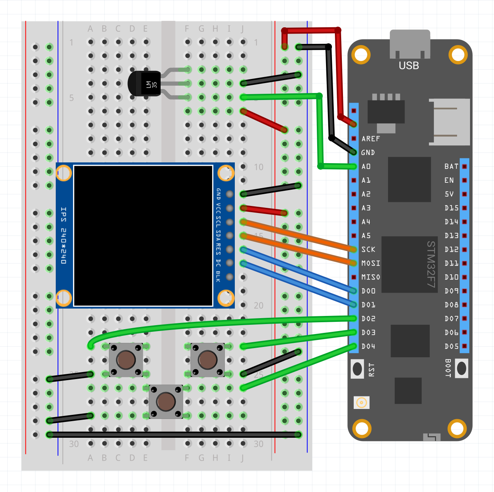

Clima is a solar-powered, custom embedded-IoT solution that tracks climate from a suite of sensors, saves data locally for access via Bluetooth, uses a RESTful Web API, and synchronizes data to the cloud.

## Clima Options

We offer clima in two options, a full dedicated kit that it's fully solar powered build and ideal to measure weather outdoors, or a much simplified version that you can build with our Hack Kits:

<table>
    <tr>
        <td>
            <strong><a href="https://store.wildernesslabs.co/collections/frontpage/products/clima-weather-station-kit">Complete Version</a></strong>
        </td>
        <td>
            <strong><a href="https://store.wildernesslabs.co/collections/frontpage/products/meadow-f7-micro-development-board-w-hack-kit-pro">Hack Kit Version</a></strong></td>
    </tr>
    <tr>
        <td>
            
        </td>
        <td>
             
        </td>
    </tr>
    <tr>
        <td>
            With this kit, the sensors included are:
            <ul>
                <li>Anemometer to measure wind speed</li>
                <li>WindVane to check wind direction</li>
                <li>Rain meter to measure precipitation</li>
                <li>BME280 to measure ambient temperature, pressure and humidity </li>
            </ul>
        </td>
        <td> 
            With the Hack Kit, you can build this project to measure indoor room temperature with an analog temperature sensor, use a 240x240 TFT Spi display and three push buttons to build a simple UI using MicroGraphics to do things like change temperature units, and more.
        </td>
    </tr>
</table>

Also includes an ASP.NET Core Web API application to test against.

## Clima Hack Kit Circuit

With an LM35 Analog Temperature sensor, a TFT SPI ST7789 display and three push buttons (all included in the Hack Kit), wire your board like the following Fritzing Diagram:



## Projects

* **WildernessLabs.Clima.Contracts** - Shared project with the data models that are shared amongs the various projects.
* **WildernessLabs.Clima.Meadow.Pro** - A client Meadow application to use with the Clima Pro climate station hardware.
* **WildernessLabs.Clima.Meadow.HackKit** 
built with the components in the Hack Kit.
* **WildernessLabs.Clima.Server.Mini.Tests** - A console application used to test the Mini server.
* **WildernessLabs.Clima.Server.Mini** - A very basic local test Web API server written in ASP.NET Core.


## Server Web API

The mini Clima server stores `ClimateReading` objects in memory will populate itself with a sample reading on start so there is always some dummy data in there.

### Getting a List of Climate Readings

**Get** - http://localhost:[port]/ClimateData

### Posting a new Reading

**Post** - http://localhost:[port]/ClimateData

Sample body payload:

```json
{
    "timeOfReading": "2020-09-23T17:43:00-07:00",
    "tempC": 23,
    "barometricPressureMillibarHg": 250,
    "relativeHumdity": 0.7
}
```
