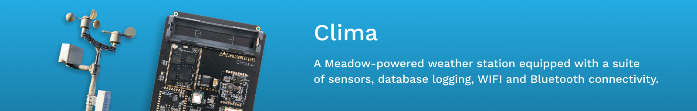

Clima is a solar-powered, custom embedded-IoT solution that tracks climate from a suite of sensors, saves data locally for access via Bluetooth, uses a RESTful Web API, and synchronizes data to the cloud.

## Clima Options

We offer clima in two options, a full dedicated kit that it's fully solar powered build and ideal to measure weather outdoors, or a much simplified version that you can build with our Hack Kits.

Both versions are 100% open source, including all of the enclosure design files, and PCB design of the pro version.

<table width="100%">
    <tr>
        <td width="50%">
            <strong><a href="https://store.wildernesslabs.co/collections/frontpage/products/clima-weather-station-kit">Clima.Pro Version</a></strong>
        </td>
        <td width="50%">
            <strong><a href="https://store.wildernesslabs.co/collections/frontpage/products/meadow-f7-micro-development-board-w-hack-kit-pro">Clima.HackKit Version</a></strong></td>
    </tr>
    <tr>
        <td>
            
        </td>
        <td>
             
        </td>
    </tr>
    <tr>
        <td>
            With this kit, the sensors included are:
            <ul>
                <li>Anemometer to measure wind speed</li>
                <li>WindVane to check wind direction</li>
                <li>Rain meter to measure precipitation</li>
                <li>BME680 to measure ambient temperature, pressure and humidity </li>
            </ul>
        </td>
        <td> 
            With the Hack Kit, you can build this project to measure indoor room temperature with an analog temperature sensor, use a 240x240 TFT Spi display and three push buttons to build a simple UI using MicroGraphics to do things like change temperature units, and more.
        </td>
    </tr>
</table>

# Clima.Pro Kit 

Hello and welcome! 

**These getting started instructions are still in beta**, please help us. :) As you run through the, please log any challenges, bugs, or enhancements in the [issues tracker](https://github.com/WildernessLabs/Clima/issues). You can also chat with us in realtime on our [Slack Server](http://slackinvite.wildernesslabs.co/). Make sure to join the `#clima` channel and say `hi!`.

## Important Note - Hooking up the solar panel

We made an important change to the clima board to handle solar charging better. If you don't have a `v1.g` or newer, please don't hook up the solar panel, as it can damage the Meadow. We've shipped out all the updated boards, they should look like this:

If your Clima has the updated solar charging circuit, you're good to go! If you haven't received one it, it's on the way.

Check out the [Core-Compute Addon Modules](https://github.com/WildernessLabs/Hardware_Addon_Modules) if you want to dive into the new solar charging circuit design.

### Solar Charging Background

We recently learned that in certain circumstances, hooking the clima PCB up to the solar panel and the battery can kill the Meadow. This is due to the nature of the battery charging circuit on the Meadow board which makes the `5V` rail effectively output only, with the USB `5V` input being the only way to appropriately power the Meadow and charge a battery with `5V` or greater.

This problem appears to be a flaw in the design spec of the Feather Form Factor itself. We've analyzed a number of Feather boards, and they employ one of two designs; ours, which prevents the `5V` pin from being an input, or another design which has the distinct possibility of blowing the host USB port that the Meadow is plugged into.

## Getting Started

1. [Buy](https://store.wildernesslabs.co/collections/frontpage/products/clima-weather-station-kit) or [Source](/Docs/Clima.Pro/Bill_of_Materials.md) a kit.
2. [Assemble it](/Docs/Clima.Pro/Assembly_Instructions/readme.md).
3. [Register for an OpenWeather API Key](https://blog.wildernesslabs.co/add-openweather-to-your-meadow-projects/)
4. [Build and Deploy the Meadow Clima.Pro App](/Docs/Clima.Pro/Deploy_Instructions/readme.md).
5. Optionally, build and deploy the [companion mobile app](/Docs/Clima.MobileApp/readme.md).

## Sourcing

A complete kit of the Pro version of Clima can be found on the [Wilderness Labs Store](https://store.wildernesslabs.co/collections/frontpage/products/clima-weather-station-kit).

The store version is 100% kit complete, including the option to include the 3D printed enclosure, and a meadow.

You can also source all of the components yourself. For a list of components see the [Clima Pro Bill of Material (BoM)](/Docs/Clima.Pro/Bill_of_Materials.md)
 
## Assembly

Instructions for assembly can be found [here](/Docs/Clima.Pro/Assembly_Instructions/readme.md).

## Known Issues

* **Battery Power** - The Meadow.OS Power and Sleep APIs haven't been released yet, so Clima can't go to sleep to conserve power. For that reason, it'll need to be plugged into USB. We're hoping to have the first sleep APIs available in b6.4.
* **Low-Power Raingauge** - The raingauge sensor is hooked to `D15`, which is a low-power counting timer, capable of counting pulses even when the Meadow is in low-power mode. This enables the rain gauge to collect data even while Clima is asleep. However, we haven't exposed that functionality via Meadow.Core yet. 

# Clima.HackKit

Instructions on how to assemble the Clima Hack Kit Version can be found [here](/Docs/Clima.HackKit/readme.md)

# Companion Phone App

This project also comes with a Xamarin.Forms Clima companion app (on Android and iOS) that shows you how to communicate with your Meadow device using [Bluetooth](http://developer.wildernesslabs.co/Meadow/Meadow.OS/Bluetooth/) and [Maple](http://developer.wildernesslabs.co/Meadow/Meadow.Foundation/Libraries_and_Frameworks/Maple.Server/) for both kit versions.

# Solution Structure

The source code for the Clima applications can be found in the [source](/Source) folder.

In there is a `clima.sln` file with the following projects in it:

* **CommonContracts** - Shared project with the data models that are shared amongs the various projects.
* **MeadowClimaHackKit** - A Meadow application for the Hack Kit version of Clima.
* **MeadowClimaProKit** - A Meadow application to use with the Clima Pro climate station hardware.
* **MeadowClimaProKit.Diagnostics** - A Meadow application used to test Clima.Pro sensors.
* **MobileApp** - Xamarin.Forms common project of Clima's companion app.
* **MobileApp.Android** - Android specific head project.
* **MobileApp.iOS** - iOS specific head project.

For more information on the application source code, please see the [source code readme](/Source/readme.md).
