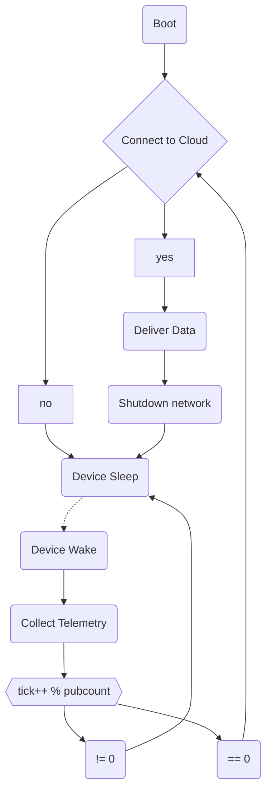

```mermaid
flowchart TD
%% Nodes
    A("Boot")
    B{"Connect to Cloud"}
    C("Deliver Data")
    D("Shutdown network")
    E("Device Sleep")
    F("Device Wake")
    G("Collect Telemetry")
    H{{"`tick++ % pubcount`"}}

    ne_0("== 0")
    eq_0("!= 0")

%% Edge connections between nodes
    A --> B
    B --> yes --> C
    B --> no --> E
    C --> D
    D --> E
    E -.-> F
    F --> G
    G --> H
    H --> eq_0 --> E
    H --> ne_0 --> B
```